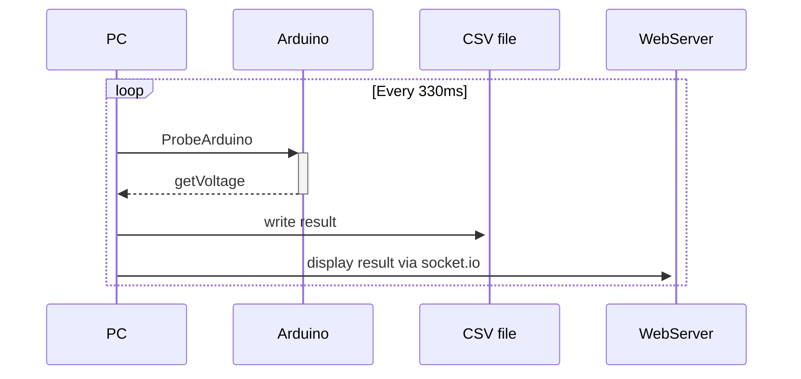

# 🔋 Battery-Recorder

### This repo contains code for monitoring battery voltage during charging

## Features
- ✍️ log data from Arduino to CSV files
- 📈 View progress via web UI
- 🔋 Include battery ID to track each battery

## Sequence Diagram:
